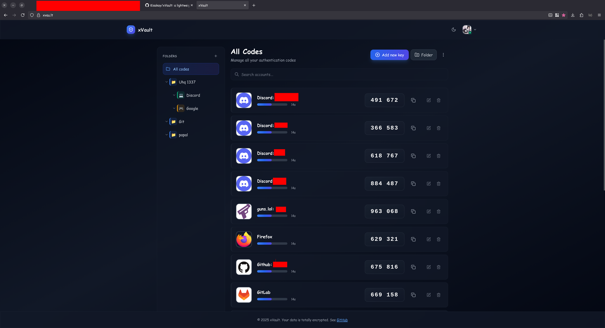

# xVault

A lightweight and secure two-factor authentication (2FA) token manager.

[](https://opensource.org/licenses/MIT)



## Overview

xVault is a self-hosted 2FA token manager that stores TOTP codes securely with AES encryption. It features a clean, minimalist interface and runs locally for maximum security.

## Features

- **🔐 Secure Storage** — AES-encrypted vault with password protection
- **⚡ Auto-Generation** — Time-based codes refresh every 30 seconds
- **📱 QR Code Scanner** — Quickly add accounts by scanning QR codes
- **📦 Export/Import** — Encrypted backup and restore functionality
- **🎨 Modern UI** — Clean, responsive interface with dark mode support
- **🔒 Local First** — Self-hosted for complete data control
- **📁 Organization** — Organize entries with folders and custom icons

## Tech Stack

- **Frontend:** React 18 + TypeScript + Vite + Tailwind CSS
- **Backend:** Express.js + SQLite
- **Encryption:** AES (CryptoJS)
- **Authentication:** Session-based with login ID system

## Prerequisites

- **Node.js** v18 or higher
- **npm** v9 or higher (or compatible package manager)

## Installation

### 1. Clone the repository

```bash
git clone https://github.com/Kisakay/xVault.git
cd xVault
```

### 2. Install dependencies

```bash
# Install client dependencies
npm install

# Install server dependencies
cd server && npm install && cd ..
```

### 3. Configure the application

Copy the example configuration file:

```bash
cp config.example.json config.json
```

Edit `config.json` with your settings:

```json
{
  "SERVER_HOST": "localhost",
  "SERVER_PORT": 3001,
  "SERVER_URL": "http://localhost:3001"
}
```

For production, update `SERVER_URL` to match your domain.

## Development

### Start both client and server

```bash
npm start
```

This starts:
- **Client** (Vite dev server) on `http://localhost:5173`
- **Server** (Express API) on `http://localhost:3001`

### Start services individually

```bash
# Client only (development server)
npm run dev

# Server only (API server)
npm run server
```

### Build for production

```bash
npm run build
```

The built files will be in the `dist/` directory, which the server serves in production mode.

## Usage

### First Time Setup

1. Launch the application and open the web interface
2. Create a new account with a strong password
3. Save your **Login ID** — you'll need it to log in
4. Add your first TOTP secret via QR code or manual entry

### Adding TOTP Entries

1. Click the **Add** button
2. Scan a QR code or enter the secret key manually
3. Name the service and (optionally) add a custom icon
4. Organize entries into folders for better management
5. Save your entry

### Generating Codes

TOTP codes are automatically generated and refresh every 30 seconds. Click on any entry to copy the code to your clipboard.

### Backup & Restore

**Export:**
1. Navigate to **Settings**
2. Select **Export Vault**
3. Enter your password to confirm
4. Save the encrypted JSON file securely

**Import:**
1. Navigate to **Settings**
2. Select **Import Vault**
3. Choose your exported file
4. Enter your password to decrypt and import

## Production Deployment

### Option 1: PM2 (Recommended)

```bash
# Install PM2 globally
npm install -g pm2

# Build the application
npm run build

# Start with PM2 using ecosystem config
pm2 start ecosystem.config.js

# Save PM2 process list
pm2 save

# Setup PM2 to start on system boot
pm2 startup
```

### Option 2: Docker

**Using Docker Compose (Recommended):**

```bash
# Build and start
docker-compose up -d

# View logs
docker-compose logs -f

# Stop
docker-compose down
```

**Using Docker directly:**

```bash
# Build the image
docker build -t xvault .

# Run the container
docker run -d \
  -p 3001:3001 \
  -v xvault_data:/app/server \
  --name xvault \
  --restart unless-stopped \
  xvault
```

The server will be available at `http://localhost:3001` (or your configured domain).

### Option 3: Systemd Service

Create `/etc/systemd/system/xvault.service`:

```ini
[Unit]
Description=xVault 2FA Manager
After=network.target

[Service]
Type=simple
User=your-user
WorkingDirectory=/path/to/xVault
ExecStart=/usr/bin/node server/server.js
Restart=always
RestartSec=10
Environment=NODE_ENV=production

[Install]
WantedBy=multi-user.target
```

Enable and start the service:

```bash
sudo systemctl enable xvault
sudo systemctl start xvault
```

## Security

### Best Practices

- **Use HTTPS** — Always use HTTPS in production (configure reverse proxy with Nginx + Let's Encrypt)
- **Strong Password** — Use a unique, complex password for your vault
- **Local Access** — Run locally or access via VPN; avoid exposing to the internet
- **Regular Backups** — Back up `server/xVault.sqlite` frequently
- **Keep Updated** — Regularly update dependencies and the application

### Nginx Reverse Proxy

Example Nginx configuration with HTTPS:

```nginx
server {
    listen 443 ssl http2;
    server_name your-domain.com;
    
    ssl_certificate /path/to/fullchain.pem;
    ssl_certificate_key /path/to/privkey.pem;
    
    # Security headers
    add_header X-Frame-Options "SAMEORIGIN" always;
    add_header X-Content-Type-Options "nosniff" always;
    add_header X-XSS-Protection "1; mode=block" always;
    
    location / {
        proxy_pass http://localhost:3001;
        proxy_http_version 1.1;
        proxy_set_header Upgrade $http_upgrade;
        proxy_set_header Connection 'upgrade';
        proxy_set_header Host $host;
        proxy_set_header X-Real-IP $remote_addr;
        proxy_set_header X-Forwarded-For $proxy_add_x_forwarded_for;
        proxy_set_header X-Forwarded-Proto $scheme;
        proxy_cache_bypass $http_upgrade;
    }
}

# Redirect HTTP to HTTPS
server {
    listen 80;
    server_name your-domain.com;
    return 301 https://$server_name$request_uri;
}
```

## Backup and Restore

### Manual Backup

The critical file is `server/xVault.sqlite` which contains all encrypted data:

```bash
# Backup the database
cp server/xVault.sqlite /path/to/backup/xVault-$(date +%Y%m%d).sqlite

# Restore from backup
cp /path/to/backup/xVault-YYYYMMDD.sqlite server/xVault.sqlite
```

### Automated Backup Script

Create a backup script (`backup.sh`):

```bash
#!/bin/bash
BACKUP_DIR="/path/to/backups"
DATE=$(date +%Y%m%d-%H%M%S)
cp server/xVault.sqlite "$BACKUP_DIR/xVault-$DATE.sqlite"

# Keep only last 30 days of backups
find "$BACKUP_DIR" -name "xVault-*.sqlite" -mtime +30 -delete
```

Add to crontab for daily backups:

```bash
0 2 * * * /path/to/backup.sh
```

## Configuration

### Server Configuration

Edit `config.json` in the root directory:

```json
{
  "SERVER_HOST": "0.0.0.0",
  "SERVER_PORT": 3001,
  "SERVER_URL": "https://your-domain.com"
}
```

- **SERVER_HOST:** Host to bind to (`0.0.0.0` for all interfaces, `localhost` for local only)
- **SERVER_PORT:** Port the server listens on
- **SERVER_URL:** Public URL of your server (used for API calls)

### Environment Variables

The server can also be configured using environment variables:

```bash
export SERVER_HOST=0.0.0.0
export SERVER_PORT=3001
export SERVER_URL=https://your-domain.com
export NODE_ENV=production
```

## Troubleshooting

### Port Already in Use

If port 3001 is already in use, either:
- Change the port in `config.json`
- Stop the process using the port: `lsof -ti:3001 | xargs kill`

### Database Issues

If you encounter database errors:
- Check file permissions on `server/xVault.sqlite`
- Ensure the `server/` directory is writable
- Verify SQLite3 is properly installed

### Build Issues

If the build fails:
- Clear `node_modules` and reinstall: `rm -rf node_modules && npm install`
- Clear Vite cache: `rm -rf node_modules/.vite`
- Check Node.js version: `node --version` (should be v18+)

## Contributing

Contributions are welcome! Please follow these steps:

1. Fork the repository
2. Create a feature branch: `git checkout -b feature/amazing-feature`
3. Commit your changes: `git commit -m 'Add amazing feature'`
4. Push to the branch: `git push origin feature/amazing-feature`
5. Open a Pull Request

## License

This project is licensed under the **MIT License**. See the [LICENSE](LICENSE) file for details.

## Support

For issues, questions, or contributions, please open an issue on [GitHub](https://github.com/Kisakay/xVault/issues).
